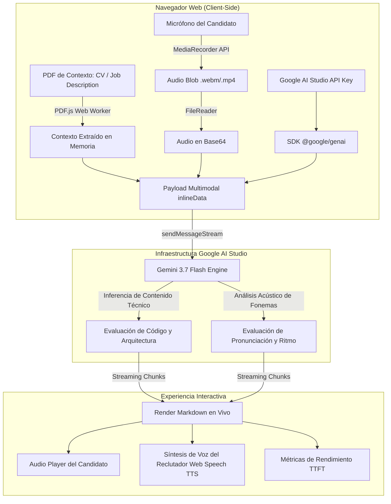

# 🎙️ Mock Interviewer AI: Documento de Arquitectura y Guía Técnica del Audio Multimodal

Este documento detalla la visión de ingeniería, la arquitectura del sistema y el funcionamiento del nuevo **Pipeline de Audio Multimodal Nativo con Gemini 3**, transformando el proyecto de un simple chatbot a un simulador acústico y técnico de entrevistas para desarrolladores internacionales.

---

## 1. Visión General del Proyecto

**Mock Interviewer AI** es una aplicación *Zero-Backend* (Client-Side Serverless) diseñada para entrenar a desarrolladores de software en entrevistas técnicas en inglés corporativo (*B2 / C1*). 

Combina:
1. **RAG Estático en Cliente:** Extracción y análisis directo de descripciones de cargo y currículums en PDF mediante Web Workers de **PDF.js**.
2. **Inferencia LLM de Frontera:** Integración con la familia **Gemini 3 Flash** a través del SDK oficial de Google (`@google/genai`).
3. **Streaming y Telemetría en Vivo:** Renderizado progresivo de Markdown con medición del *Time to First Token (TTFT)* y latencia de inferencia.
4. **Evaluación Acústica Multimodal:** Captura de voz real del candidato para análisis fonético, entonación, ritmo y presencia ejecutiva.

---

## 2. Diagrama de Arquitectura del Sistema



---

## 3. El Cambio Clave: De STT Local a Audio Multimodal Nativo

### ¿Por qué el enfoque tradicional (Speech-to-Text) era insuficiente?
En las aplicaciones convencionales, el navegador usa la Web Speech API para transcribir la voz a texto antes de enviarla al modelo. Esto creaba una barrera insuperable:

| Factor | Speech-to-Text Tradicional (STT) | Audio Multimodal Nativo (MediaRecorder + Gemini) |
| :--- | :--- | :--- |
| **Lo que recibe el LLM** | Texto plano transcrito por el navegador. | El archivo de audio real con todos sus armónicos y fonemas. |
| **Evaluación de Fonemas** | ❌ **Imposible.** El navegador autocorrige los errores antes de transcribir. | ✅ **Directa.** Gemini escucha la articulación real de cada sílaba. |
| **Entonación y Seguridad** | ❌ No detecta tono dubitativo o monótono. | ✅ Identifica pausas inseguras, energía vocal y confianza. |
| **Muletillas (Fillers)** | ❌ Se suelen filtrar (*"ehh", "like", "you know"*). | ✅ Detecta y cuenta el abuso de muletillas en vivo. |
| **Términos Técnicos** | ❌ Suele transcribir mal palabras como *Kubernetes*, *Async*, *OAuth*. | ✅ Evalúa la pronunciación exacta de la jerga de ingeniería. |

---

## 4. Pipeline Técnico del Audio Multimodal (Paso a Paso)

### Paso 1: Captura de Audio de Alta Fidelidad en el Navegador
Utilizamos `navigator.mediaDevices.getUserMedia` acoplado con `MediaRecorder`. El sistema detecta dinámicamente el mejor códec soportado por el navegador (priorizando `audio/webm;codecs=opus`):

```javascript
const stream = await navigator.mediaDevices.getUserMedia({ audio: true });
mediaRecorder = new MediaRecorder(stream, { mimeType: 'audio/webm;codecs=opus' });

mediaRecorder.ondataavailable = (event) => {
  if (event.data && event.data.size > 0) audioChunks.push(event.data);
};
```

### Paso 2: Creación del Blob y Reproductor Local
Al finalizar la grabación, se genera un objeto Blob y una URL local (`URL.createObjectURL`). Esto permite que el candidato **escuche su propia grabación** en la burbuja del chat:

```javascript
const audioBlob = new Blob(audioChunks, { type: 'audio/webm' });
const audioUrl = URL.createObjectURL(audioBlob);
appendMessage('user', '', audioUrl);
```

### Paso 3: Codificación Binaria a Base64
Convertimos el archivo de audio a una cadena Base64 limpia para ser transmitida sin necesidad de subir archivos a un servidor intermedio o bucket S3:

```javascript
function blobToBase64(blob) {
  return new Promise((resolve, reject) => {
    const reader = new FileReader();
    reader.onloadend = () => resolve(reader.result.split(',')[1]);
    reader.onerror = reject;
    reader.readAsDataURL(blob);
  });
}
```

### Paso 4: Inyección en el Payload Multimodal de Gemini
El SDK `@google/genai` recibe un arreglo que combina la parte binaria (`inlineData`) y la directiva textual de análisis:

```javascript
const multimodalPayload = [
  {
    inlineData: {
      mimeType: audioBlob.type || 'audio/webm',
      data: base64Audio
    }
  },
  {
    text: "Analyze my spoken response: evaluate both technical content AND spoken pronunciation, cadence, and phonetics."
  }
];

const responseStream = await chatSession.sendMessageStream({ message: multimodalPayload });
```

---

## 5. Matriz de Evaluación del Reclutador (System Prompt)

El *System Instruction* instruye a Gemini a actuar simultáneamente como **Engineering Manager de Silicon Valley** y como **Coach de Pronunciación Técnica en Inglés**, dividiendo cada respuesta en:

```markdown
### 🎯 Technical Content & Grammar
- **Technical Accuracy:** Evaluación de la lógica, arquitectura y conceptos de ingeniería.
- **Grammar & Phrasing:** Identificación de sintaxis débil o errores gramaticales en **negrita**, con alternativas en *cursiva*.

### 🗣️ Pronunciation, Phonetics & Delivery
- **Pronunciation & Phonetics:** Errores fonéticos específicos con su guía de pronunciación internacional (IPA) (ej. *Asynchronous* -> `/eɪˈsɪŋ.krə.nəs/`, terminaciones en *-ed* regulares /t/, /d/, /ɪd/).
- **Vocal Delivery & Cadence:** Ritmo de habla, entonación, seguridad y reducción de muletillas (*"uhm", "like", "you know"*).

---

### 💬 Next Question
- Exactamente **UNA** pregunta técnica o conductual estructurada según el PDF del cargo.
```

---

## 6. Módulos de Control, Resiliencia y UX Avanzada

1. **Persistencia Automática de Sesión (`localStorage`):**
   - El historial de la conversación (mensajes de texto, contexto del PDF seleccionado, modelo y grabaciones de audio) se sincroniza en tiempo real en `localStorage` bajo la clave `active_interview_session`.
   - Si recargas la página o cierras el navegador por accidente, la sesión y el historial completo se restauran instantáneamente sin perder tu progreso.
   - El botón **`🏠 Salir al Inicio`** limpia de forma segura el historial almacenado para permitir una nueva entrevista limpia.

2. **Actualización de API Key en Caliente (Hot Key Swap):**
   - Botón **`🔑 Cambiar Key`** directamente en la barra superior del chat con modal accesible.
   - Si se agota la cuota gratuita de tokens (*Error 429 / RESOURCE_EXHAUSTED*), la interfaz despliega un aviso interactivo permitiéndote ingresar una nueva API Key de Google AI Studio al instante **sin interrumpir ni reiniciar la entrevista en curso**.

3. **Gestión Modular de Sesión:**
   - **`📊 Generar Reporte`:** Solicita la conclusión formal de la entrevista sin borrar la pantalla, entregando nivel observado (*B1 / B2 / C1*), decisión de contratación (*Strong Hire / Hire / Needs Practice*) y plan de acción.
   - **`🏠 Salir al Inicio`:** Resetea el estado volátil, detiene audios y regresa a la selección de PDFs y modelos.

4. **Doble Vía de Audio y Previsualización:**
   - **Entrada (Candidato):** Grabación con previsualización, botón de escucha previa antes de enviar y descarte rápido.
   - **Salida (Reclutador IA):** Síntesis de voz automática mediante `SpeechSynthesis` con botón `⏹️ Detener Voz` en la esquina superior izquierda de cada respuesta y `🔊 Escuchar` para repetición.

5. **Selector de Modelos Gemini 3:**
   - Compatibilidad completa con **Gemini 3.7 Flash**, **Gemini 3.6 Flash** y **Gemini 3.5 Flash**, garantizando cero errores `404` por modelos obsoletos.

---

## 7. Conclusión del Tech Lead

Esta arquitectura demuestra cómo es posible construir una herramienta de preparación de **alto impacto y grado profesional** sin incurrir en costos de backend ni almacenamiento de datos sensibles en servidores de terceros. 

Aprovecha la capacidad multimodal nativa de **Gemini** al máximo: no solo analiza el qué se dice, sino el **cómo se dice**.
